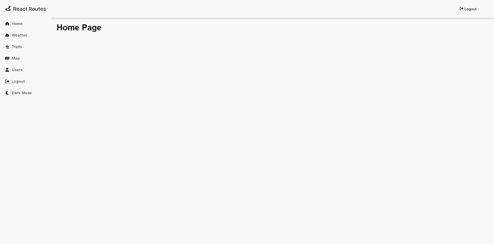
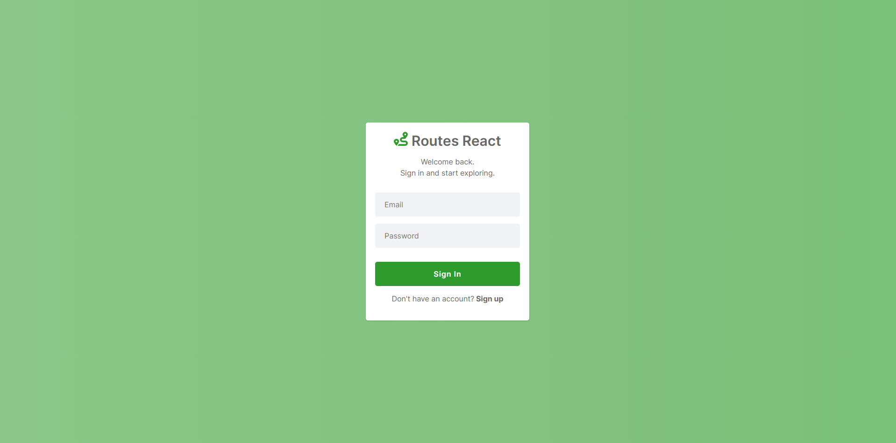

<h1 align="center">Customer API</h1>

  <a href="#-technologies">Technologies</a>&nbsp;&nbsp;&nbsp;|&nbsp;&nbsp;&nbsp;
  <a href="#-project">Project</a>&nbsp;&nbsp;&nbsp;|&nbsp;&nbsp;&nbsp;
  <a href="#-layout">Layout</a>
  

 

## 🚀 Technologies

 
 

 
 

## 💻 Project

**Application for registering outdoor trails.** Users can save and search for trails and wheater conditions.

## 🔖 Layout

### 1. Home

Project structure representation:

  

### 2. Sign In

Project structure representation:

  

### 3. Sign Up

Project structure representation:

  

## 🚧 Prerequisites
No prerequisites required.

---